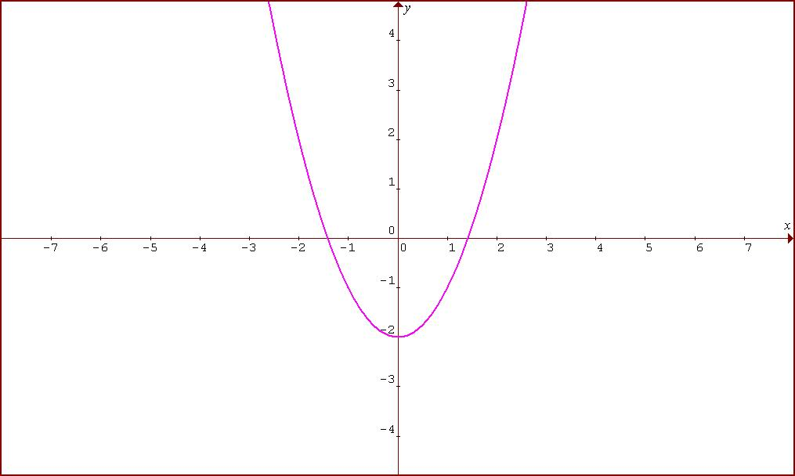

# Presentación de la asignatura

## Documentación importante

::: {.callout-note  icon=false}


+ [Guía Docente](https://www.comillas.edu/grados/grado-en-ingenieria-biomedica/#planestudios)

:::

## Profesor

::: {.callout-note  icon=false}

### Información de contacto:

+ Fernando San Segundo, 
+ [fsansegundo@comillas.edu](mailto:fsansegundo@comillas.edu)  
La vía de contacto preferente es el correo (evitar Teams o teléfono, la respuesta tardará más).
+ Despacho: D-412

:::

## Metodología

::: {.callout-note  icon=false}

### Cómo cursar con éxito esta asignatura.

+ Trabajo diario
+ En serio, ¡trabajo diario!
+ Participa en clase.
+ **¡Usa las tutorías!**

:::

## Evaluación

::: {.callout-note  icon=false}

### Componentes de la evaluación

+ Evaluación continua
+ Examen intercuatimestral
+ Examen final

:::

## Recursos computacionales

::: {.callout-note  icon=false}

### Google Colab

+ [Carpeta con notebooks del curso](https://drive.google.com/drive/folders/1-eAdxpL3laKVf8n79jonTdrSa3stJp2A?usp=sharing)
+ Es necesario disponer de una cuenta Google. 
**No uses tu cuenta personal**

::: 

::: {.callout-note  icon=false}

### Wolfram Alpha

[Enlace con ejemplo de uso](https://www.wolframalpha.com/input?i=derivative+of+f%28x%29+%3D+x%5E2+-+2&lang=es)

:::

::: {.callout-note  icon=false}

### GeoGebra

[Construcciones GeoGebra](https://www.geogebra.org/u/fernando.sansegundo)

:::


## Uso de la IA en la asignatura

::: {.callout-note  icon=false}

Ver guía de la universidad

:::

---

**Sesión 01. Introducción a la idea fundacional del Cálculo Diferencial**

{height="60%" fig-align="center"}


+ [Notebook de la sesión en Colab](https://colab.research.google.com/drive/1K9P41LGTmIuGCPvt2NUwppZmZpcd4vDg?usp=sharing)

---

```{=latex}
  
  \frametitle{Tabla de contenidos}
  \tableofcontents

```


# Introducción a la idea fundamental del Cálculo Diferencial


## La raíz de 2

Los números racionales $\mathbb{Q}$ son las fracciones que se estudian en el colegio, cocientes de números enteros $\mathbb{Z}$. Por lo tanto un número racional se puede escribir
$$
\dfrac{m}{n}\quad\text{ con }m, n\in \mathbb{Z}
$$

::: {.callout-note  icon=false}

### La raíz cuadrada de 2 \textbf{no es un número racional}:

\textbf{Argumento rápido:} suponemos $(m/n)^2 = 2$ con m, n sin factores comunes (¡en particular no pueden ser los dos pares!) Entonces $m^2 = 2 n^2$ luego m es par, $m = 2 k$. Pero entonces $2 n^2 = (2 k)^2$, luego $n^2 = 2 k^2$ y $n$ sería también par.

:::

Los números racionales tienen desarrollos decimales periódicos (y es fácil pasar de fracción a desarrollo y viceversa). Así que $\sqrt{2}$ tiene un desarrollo decimal no periódico. **¿Cómo lo calcularías?**

## Formulando el problema en el lenguaje de las funciones

Afortunadamente podemos usar varios grandes avances ocurridos en la historia de las Matemáticas:

+ La notación algebraica y el uso de $x$:
$$\sqrt{2} \, \text{ es la solución positiva de la ecuación }\, x^2 - 2 = 0$$
+ La idea de función y su representación gráfica: si definimos la función 
$$f(x) = x^2 - 2$$
entonces sus raíces son los cortes de la gráfica de $f$ con el eje (horizontal) $X$.  
Si piensas en $y = x^2 - 2$ y haces $y = 0$ (para buscar las raíces) tal vez lo veas más claro.

## Representación gráfica de estas ideas

La gráfica de $y = x^2 - 2$ es una parábola como la de esta figura. 

{height="40%" fig-align="center"}

El valor  $\sqrt{2}$ es la coordenada $x$ del punto de corte de la parábola con el semieje positivo $X$.

::: {.callout-note  icon=false}

### Observaciones

Fíjate en que $f(x)$ es negativa en $1$ y positiva  en $2$; la gráfica de $f$ \textbf{corta el eje en el intervalo $(1, 2)$.}

::: 

## El método de Newton

Es fácil encontrar una (pobre) aproximación por tanteo para $\sqrt{2}$. Por ejemplo, como 
$$1.4^2 = 1.96 < 2 < 1.5^2 = 2.25$$
podríamos empezar diciendo algo como $\sqrt{2}\approx 1.5$.

¿Como pasamos de esto a una aproximación con diez cifras decimales? A Newton se le ocurrió una de esas ideas suyas: 

Vamos a verlo usando una [construcción GeoGebra](https://www.geogebra.org/m/t5nfjdje)

En resumen:

::: {.callout-caution  icon=false appearance="simple"}
1) Tu aproximación inicial es $x_0 = 1.5$
2) Calcula el valor $y_0 = f(x_0) = x_0^2 - 2 \to$ Sube a la gráfica  
3) Calcula la **recta tangente** a $f(x)$ en $(x_0, y_0)$.
4) Sea $x_1$ el corte de esa recta con el eje $\to$ baja por la recta tangente.
5) Cambia $x_0$ por $x_1$ y **repite** hasta conseguir la precisión deseada.

:::

---

Como habrás observado, el método se basa en la capacidad de resolver este:

::: {.callout-note  icon=false}
###  Problema fundacional del Cálculo Diferencial

Dada una función $f(x)$, hallar su [**recta tangente**]{.underline} en el punto $(x_0, f(x_0))$
:::

::: {.callout-note  icon=false}
### Observaciones

+ ¿Qué queremos decir cuando hablamos de recta tangente? Vuelve a GeoGebra y reflexiona.
+ El método de Newton también depende de la *forma de la función cerca de la ráiz*. ¿Qué quiere decir esto? ¿Se te ocurre otro caso en el que esta idea no funcionaría?
:::

::: {.callout-tip  icon=false appearance="minimal"}
  
\textbf{\textcolor{blue}{Ejercicio 01A01a}} Seguro que ya sabes derivar $f(x) = x^2 - 2$ y que la derivada sirve para hallar la recta tangente. ¿Cuál es esa recta tangente a $f(x)$ cuando $x_0 = 1.5$?

$\,$

\textbf{\textcolor{firebrick}{Ejercicio 01B01}} En la página \pageref{sec:derivadas} tienes muchas funciones con las que refrescar tus conocimientos de las reglas de dderivación.

:::

---

::: {.callout-note  icon=false}

### Una iteración del método de Newton

En primer lugar comprueba que:

+ la recta tangente a $f(x)$ cuando $x = x_0$ es
$$y = f(x_0) + f'(x_0) (x - x_0)$$

+ El punto de corte de esta recta con el eje $X$ (siguiente aproximación de la raíz es) se obtiene haciendo $y=0$ y despejando $x$. Resultado:
$$x_1 = x_0 - \dfrac{f(x_0)}{f'(x_0)}$$

:::

::: {.callout-tip  icon=false appearance="minimal"}
  
\textbf{\textcolor{blue}{Ejercicio 01A01b}}

Escribe la ecuación para obtener $x_1$ cuando $f(x) = x^2 - 2$. ¿Qué operaciones necesitas para esto?

:::

## Implementación del método de Newton en Python 

::: {.callout-note  icon=false}

### Cálculo numérico

Si piensas en el tipo de operaciones que sabemos hacer con circuitos electrónicos (sumas y restas, productos y divisiones... las del cole) te darás cuenta de que el anterior ejercicio concluye que el Método de Newton proporciona una base para construir calculadoras.

:::

$\quad$

En el siguiente notebook vamos a usar Python para ver en acción el método de Newton.

::: {.callout-warning  icon=false appearance="simple"}

[Notebook de la sesión en Colab](https://colab.research.google.com/drive/1K9P41LGTmIuGCPvt2NUwppZmZpcd4vDg?usp=sharing)

:::

::: {.callout-tip  icon=false appearance="minimal"}
  
\textbf{\textcolor{darkgreen}{Ejercicio 01C01}}

La raíz cúbica de 2 es aproximadamente $1.26$. Usa el método de Newton para calcularla con una precisión de 10 cifras decimales. ¿Qué función debes usar? 

:::

# Práctica de cálculo de derivadas
\label{sec:derivadas}

### Calcular y simplificar las derivadas de las siguientes funciones:

\small

 [1] $f(x)=3x^{2}-6x+5$ [2] $f(x)=\frac{x^{2}+3x}{2}$ [3] $f(x)=\sqrt{2x}+\sqrt[3]{3x}$

 [4] $f(x)=\frac{1}{x\sqrt{x}}$ [5] $f(x)=\sin(x)\cos(x)$ [6] $f(x)=xe^{x}$

 [7] $f(x)=(x^{2}+1)\log(x)$ [8] $f(x)=\frac{x^{2}-3x+3}{e^{-x}}$ [9] $f(x)=(\sin(x)+\cos(x))e^{x}$

[10] $f(x)=\frac{x^{2}+1}{x^{2}-1}$ [11] $f(x)=\frac{\log(x)}{x}$ [12] $f(x)=\frac{e^{x}}{\cos(x)}$

[13] $f(x)=(x^{2}-3)^{3}$ [14] $f(x)=\sqrt{1+2x}$ [15] $f(x)=\sqrt[3]{(5x+3)^{2}}$

[16] $f(x)=\frac{3}{\sqrt{1-x^{2}}}$ [17] $f(x)=\cos(\sqrt{x})$ [18] $f(x)=\sin(x^{2}-5x+7)$

[19] $f(x)=xe^{2x+1}$ [20] $f(x)=x \arcsin(\sqrt{x})$ [21] $f(x)=\left(\frac{x}{1+x^{2}}\right)^{2}$

[22] $f(x)=\frac{\log(x^{3})}{x}$ [23] $f(x)=\frac{\sin(x^{2}+1)}{\sqrt{1-x^{2}}}$ [24] $f(x)=\log\left(\frac{x^{2}}{3-x}\right)$

[25] $f(x)=\arctan\left(\frac{1-x}{1+x}\right)$ [26] $f(x)=\frac{1+\tan\left(\frac{x}{2}\right)}{1-\tan\left(\frac{x}{2}\right)}$ [27] $f(x)=\sqrt{\log(x)}$

[28] $f(x)=3^{5-x}+\frac{1}{\sqrt{x}}$ [29] $f(x)=\cosh(\log(x))$ [30] $f(x)=\operatorname{argsh}(x^{2})$

\normalsize

---

\small

###


[31] $f(x)=\cos^{2}x+e^{\sin(x)}$ [32] $f(x)=\arctan(x)+\log(1+x^{2})$ 

[33] $f(x)=\arcsin(x)+\sqrt{1-x^{2}}$ [34] $f(x)=\log(x+\sqrt{1+x^{2}})$ 

[35] $f(x)=\frac{1+\sin(x)}{1-\sin(x)}+\log(1-\sin(x))$ [36] $f(x)=\operatorname{Ln}\left(\frac{1+\sin(x)}{\tan(x)}\right)$

[37] $f(x)=\arctan\left(\frac{\sin(x)}{1+\cos(x)}\right)$ [38] $f(x)=\arctan\left(\frac{x}{\sqrt{1-x^{2}}}\right)$ 

[39] $f(x)=\arcsin(\sqrt{1-4x^{2}})$ [40] $f(x)=\log\left(\sqrt[4]{\frac{1-\sin(x)}{1+\sin(x)}}\right)$ 

[41] $f(x)=x^{x}$
[42] $f(x)=\sqrt{(\sin(x))^{\cos(x)}}$ 

\normalsize


