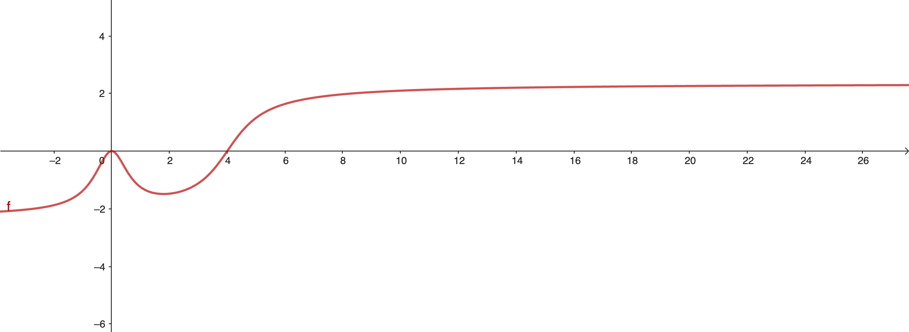
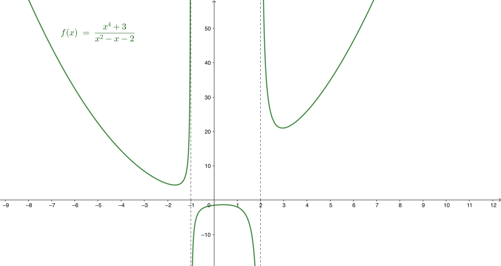

---

**Sesión 04. Más sobre cálculo de límites.**

{#fig-portada width="80%"}


+ [Notebook de la sesión en Colab](https://colab.research.google.com/drive/1MWP6sQbx6mYALz5EPvIHAY5Qa1-w8kPY?usp=sharing)


---

```{=latex}
  
  \frametitle{Tabla de contenidos}
  \tableofcontents

```


# Introducción. 

Nos gusta pensar en los límites como una especie de *zoom* . Hasta ahora hemos pensado en hacer zoom para *aumentar*. Pero a veces queremos hacer zoom para *alejar* y ver qué pasa cuando $x$ se hace muy grande (positivo o negativo). En términos coloquiales, ¿qué hace la función hacia el borde derecho o izquierdo de la pantalla?

$\quad$

También podemos preguntarnos por aquellos casos en los que la función toma valores cada vez más grandes en valor absoluto, hacia los bordes superior o inferior de la pantalla por así decir. En esta sesión vamos a ocuparnos de entender la terminología y las situaciones que pueden presentarse en esos casos


# Límites en infinito

::: {.callout-note  icon=false}

## Idea intuitiva de límite en infinito

Decimos que el *límite en infinito a la derecha* de $f$ es $L$ y escribimos
$$\lim_{x\to\infty}f(x) = L$$
si la función se puede hacer tan parecida a $L$ como se desee tomando valores de $x$ suficientemente grandes. De manera similar se define el *límite en infinito a la izquierda*:
$\displaystyle\lim_{x\to-\infty}f(x)$
:::

::: {.callout-tip  appearance="minimal"}

\textbf{\textcolor{blue}{Ejercicio 04A01.}} 

¿Cuál es el límite en  infinito de la siguiente función? No se trata de que apliques ningún *método* de Cálculo, lo que debes preguntarte es: "Si uso un valor muy grande, como $x = 10^6$, ¿cuál es aproximadamente el valor de $f(x)$?"
$$f(x) = \frac{3x^2 - x - 2}{5 x^2 + 7 x - 3}$$

:::


---

::: {.callout-note  icon=false}

## Asíntota horizontal a la derecha

Cuando $\displaystyle \lim_{x\to\infty}f(x) = L$, decimos que la recta $y = L$ es una asíntota horizontal a la derecha (análogamente a la izquierda). La siguiente figura muestra un ejemplo típico de una asíntota horizpntal a la derecha.

:::

{#fig-asintotaHorizDcha width="60%" fig-align="center"}

::: {.callout-tip  appearance="minimal"}

\textbf{\textcolor{blue}{Ejercicio 04A02}}

La función es $f(x) = \frac{3x^2}{2x^2 + 1}\arctan(x - 4)$. ¿Cuál es esa asíntota? ¿Hay asíntota a la izquierda?

:::


---


::: {.callout-note  icon=false}

## Observaciones

+ Cuando decimos
$$\lim_{x\to\infty}f(x) = \infty$$
queremos decir que los valores de la función son (todos) tan grandes (y positivos) como se desee para cualquier $x$ suficientemente grande. Otras expresiones similares se interpretan análogamente.

$\quad$

+ Hay casos en los que el límite en infinito no existe. Por ejemplo, la función $f(x) = \sin(x)$ no tiene límite en infinito, ya que sus valores oscilan entre -1 y 1 sin acercarse a ningún número en particular.

:::

---

::: {.callout-note  icon=false}

## Asíntotas oblicuas de una función

La recta $y = m x + n$ es una asíntota oblicua de la función $f$ a la derecha si la función y la recta se pueden hacer tan parecidas como se desee tomando valores de $x$ suficientemente grandes (análogamente se define asíntota oblicua a la izquierda). A partir de 
$$f(x)\approx mx + n \quad \text{cuando } x\to\infty$$
se obtiene:
$$\lim_{x\to\infty} \frac{f(x)}{x}  - m + \frac{n}{x} = 0\Rightarrow m = \lim_{x\to\infty} \frac{f(x)}{x}$$
Y entonces fácilmente se llega a:
$n = \displaystyle\lim_{x\to\infty} (f(x) - m x)$


::: 

::: {.callout-important  appearance="minimal"}

### Nota 

Una función no puede tener más de una asíntota a la derecha (o a la izquierda). Si $f$ tiene una asíntota oblicua (resp. horizontal) a la derecha, entonces no puede tener asíntota horizontal (resp. oblicua) a la derecha.  
¿Por qué?

:::

# Límites infinitos

::: {.callout-note  icon=false}

## Idea intuitiva de límite infinito

Decimos que el *límite de $f$ en $x_0$ es infinito* si (todos) los valores de $f$ son tan grandes como se desee cuando $x$ está suficientemente cerca de $x_0$.  
De forma análoga se define el límite menos infinito. Pero hay que tener en cuenta que los límites laterales pueden ser ambos infinitos, o uno $+\infty$ y el otro $-\infty$, uno finito y otro infinito, etc., como se ilustra en la siguiente figura.
:::


{#fig-limiteInfinito width="60%" fig-align="center"}

---

::: {.callout-note  icon=false}

## Asíntota vertical

Cuando la función $f$ tiene un límite infinito o menos infinito en $x_0$, decimos que la recta $x = x_0$ es una asíntota vertical de la función. Basta de hecho con que uno de los límites laterales sea $\infty$ o $-\infty$. Podemos precisar más si es necesario explicando cuáles son los límites laterales de $f$ en $x_0$

:::


::: {.callout-tip  appearance="minimal"}

\small

\textbf{\textcolor{firebrick}{Ejercicio 04B01.}} Hallar todas las asíntotas de la función $f(x) = \dfrac{x^2 + 1}{x + 2}$.

$\quad$

\textbf{\textcolor{firebrick}{Ejercicio 04B02.}} 
La función de la anterior figura es $\displaystyle f(x) = \dfrac{x⁴ + 3}{(x - 2)(x + 1)}$
y tiene una asíntota vertical en $x = 2$. El límite lateral por la derecha en ese punto es $+\infty$. ¿Cómo de cerca (y a la derecha) de $x = 2$ tiene que estar $x$ para poder garantizar que $f(x) > 10^6$?  
**Indicación:** Si $2 < x < 3$, ¿qué puedes decir de $x^4 +3$ y $x + 1$? ¿Por qué el factor más importante es $x - 2$?

$\quad$

\textbf{\textcolor{darkgreen}{Ejercicio 04C01.}} 
Mira el [notebook de la sesión](https://colab.research.google.com/drive/1MWP6sQbx6mYALz5EPvIHAY5Qa1-w8kPY?usp=sharing) para encontrar de forma aproximada ese mismo resultado. Después estima de manera similar cómo de cerca debe estar $x$ de -1 por la derecha para garantizar que $f(x) < 10^7$.

\normalsize

:::

# Regla del Sandwich


::: {.callout-note  icon=false}

## Límites "cero por acotado"

Supongamos que queremos calcular un límite que tiene **forma de producto**:
$$\lim_{x \to A} f(x)\, g(x)$$
donde:

+ $A$ puede ser finito o infinito y el límite puede ser lateral.
+ $f(x)$ es una función que **tiende a cero** cuando $x \to A$.
+ $g(x)$ es una función **acotada** en un entorno de $A$. Es decir, existen números $M$ y $N$ tales que $M < f(x) < N$ para todo $x$ cerca de $x_0$.

Entonces:
$$\lim_{x \to A} f(x) g(x) = 0$$
:::

::: {.callout-warning  icon=false appearance="minimal"}

\textbf{\textcolor{red}{Atención.}} 
Nunca es suficiente decir "$g(x)$ está acotada". Debes indicar cuáles son $M$ y $N$.

:::

---

::: {.callout-tip  appearance="minimal"}

\textbf{\textcolor{blue}{Ejercicio 04A03.}}

El ejemplo canónico de la Regla del Sandwich es el límite:
$\displaystyle\lim_{x \to 0} x \,\sin\left(\frac{1}{x}\right)$   
Recuerda que ya vimos la función $\sin(1/x)$ en la sesión 03. ¿Cuáles son aquí $M$ y $N$?

:::

::: {.callout-tip  appearance="minimal"}

\small

\textbf{\textcolor{darkgreen}{Ejercicio 04C02.}} 
Mira el notebook de la sesión para ver cómo se comporta esta función producto cerca del origen. Mira también esta [construcción GeoGebra](https://www.geogebra.org/material/show/id/fqjkbfjg).

$\quad$

\textbf{\textcolor{firebrick}{Ejercicio 04B03.}} Demuestra que 
$\displaystyle\lim_{x \to 0} \sin(x) \,\left(\dfrac{\log(x)}{x^2 + (\log(x))^2}\right) = 0$   

$\quad$


\textbf{\textcolor{darkgreen}{Ejercicio 04C03.}} Dibuja la función.


:::
