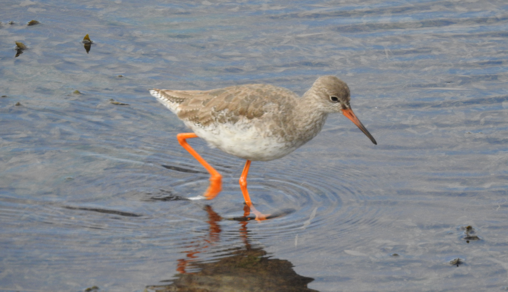

---

**Sesión 05. Teoremas globales sobre funciones continuas y derivables.**

{width="80%"}

Archibebe común, Cantabria.

+ [Notebook de la sesión en Colab](https://colab.research.google.com/drive/16xDSosCsWaurDy-W0YcsV0VJLcS3Y3zG?usp=sharing)


---

```{=latex}
  
  \frametitle{Tabla de contenidos}
  \tableofcontents

```


# Introducción. 

Muchas de las herramientas del Cálculo, como las derivadas y los límites, se definen *localmente*. Es decir, examinando el comportamiento de la función en un punto $x_0$ y sus vecinos más cercanos (en un entorno de $x_0$). Es como examinar la función a nivel microscópico. 

$\quad$

Pero si queremos hacer afirmaciones a nivel *macroscópico* necesitamos instrumentos que nos permitan hacer ese cambio de escala para ser capaces de decir algo sobre el comportamiento de la función en un intervalo cuyo tamaño pueda ser arbitrariamente grande. Los teoremas que vamos a ver en esta sesión son un ejemplo destacado de esa clase de instrumentos, pero no el único ejemplo que veremos a lo largo del curso. 

$\quad$

Al final de la sesión veremos como aplicar esos teoremas para estimar el número de raíces de una función $f(x)$. Es decir, soluciones de la ecuación $f(x) = 0$.

# Derivada y continuidad.

::: {.callout-note  icon=false}

# Examinando el límite de la definición de derivada

Recuerda la definición de derivada como límite:
$$
f'(x_0) = \lim_{x\to x_0}\dfrac{f(x) - f(x_0)}{x - x_0}
$$
El denominador siempre \underline{tiende a cero}.  Si en un cociente y el denominador tiende a 0, la  \underline{única forma} de que el límite exista es que el numerador tienda a 0 (para que sea 0/0 y la indeterminación se resuelva). Por tanto debe ser:
$$
\lim_{x\to x_0}f(x) - f(x_0) = 0,\quad\text{ es decir }\lim_{x\to x_0}f(x) = f(x_0) 
$$
Eso significa que $f$ es continua en $x_0$. La mejor forma de recordar este resultado es así:  

**Si $f$ no es continua en $x_0$ entonces no puede ser derivable en $x_0$.** Al revés no funciona: ya conoces ejemplos de funciones continuas sin derivada, ¿verdad?


:::


# Teorema de Bolzano.

::: {.callout-note  icon=false}

## Enunciado e intuición detrás del teorema.

El teorema de Bolzano se resume en: si una función continua cambia de signo en un intervalo, entonces tiene que cruzar el eje $X$ al menos una vez.

$\quad$

**Enunciado formal:** sea $f(x)$ una función continua en $[a, b]$. Supongamos que $f(a)f(b) < 0$ (es decir, $f(a)$ y $f(b)$ son de signos distintos). Entonces existe al menos un valor intermedio $c$ (es decir $a < c < b$) tal que $f(c) = 0$.

:::

::: {.callout-warning  icon=false}

## Notas:

+ El teorema dice **al menos un valor $c$**. Pueden ser muchos, piensa en $\sin(x)$ entre 0 y $20\pi$.
+ El teorema no dice dónde está ese valor (o valores) $c$, más allá de que $a < c < b$.
+ La continuidad de $f$ es esencial.

:::

---

::: {.callout-tip  appearance="minimal"}

\textbf{\textcolor{blue}{Ejercicio 05A01.}} Demuestra que la gráfica de $f(x) = x^3 - 7 x + 1$ corta al eje $X$. 

$\quad$

\textbf{\textcolor{darkgreen}{Ejercicio 05C01.}} Usa el notebook de esta sesión para explorar las soluciones de $x^3 - 7 x + 1 = 0$ (raíces de $f$).  

$\quad$

\textbf{\textcolor{blue}{Ejercicio 05A02.}} Sean $f$ y $g$ funciones continuas en $[a, b]$ tales que $f(a) < g(a)$ y $f(b) > g(b)$. Demostrar que la gráfica de $f$ corta a la gráfica de $g$ en algún punto del intervalo $(a, b)$. 

$\quad$

\textbf{\textcolor{firebrick}{Ejercicio 05B01.}} **Teorema de los valores  intermedios** Sea $f(x)$ una función continua en $[a, b]$. Supongamos que 
$$f(a) < M  < f(b)$$
Demostrar que existe un valor $c \in (a, b)$ tal que $f(c) = M$.

$\quad$

\textbf{\textcolor{firebrick}{Hoja 1b GITI 25-26.}} Ejercicios 12, 13, 14, 15. 
:::


# Teorema de Rolle.

::: {.callout-note  icon=false}

## Intuición detrás del teorema. Signo de la derivada y crecimiento.

+ Cuando una función sube (es *creciente*) su recta tangente tiene pendiente positiva.
+ Cuando la función baja (es *decreciente*) su recta tangente tiene pendiente negativa.
+ Por tanto, en los puntos donde la función cambia su comportamiento y pasa de crecer a decrecer cabe esperar que su derivada valga 0.

$\quad$

Puedes experimentar con estas ideas usando esta [construcción GeoGebra](https://www.geogebra.org/m/u3cjvucd). La discusión anterior asume tácitamente que la función es **continua y derivable.** Y es muy importante entender que ambas condiciones son necesarias en la discusión que sigue. 

:::

::: {.callout-tip  appearance="minimal"}

\textbf{\textcolor{blue}{Ejercicio 05A03.}} Recuerda lo que aprendimos sobre la derivada del valor absoluto y analiza la frase *"cuando la función pasa en $x_0$ de ser creciente a decreciente, su derivada vale cero en $x_0$"*. 

:::

---

::: {.callout-note  icon=false}

## Teorema de Rolle, enunciado formal. 

+ Sea $f(x)$ una función continua en el intervalo $[a, b]$ y derivable en $(a, b)$. 
+ Suponemos que $f(a) = f(b)$ (la función empieza y termina a la misma altura).

$\quad$

Entonces existe al menos un punto intermedio $a < c < b$, en principio desconocido, para el que $$f'(c) = 0$$

:::

::: {.callout-tip  appearance="minimal"}

\textbf{\textcolor{blue}{Ejercicio 05A04.}} Dibuja el teorema. Es decir, trata de pensar en ua función contniua y derivable para la que $f(a) = f(b)$. Y conecta los dos puntos $(a, f(a))$ y $(b, f(b))$. ¿Cuál es el punto o puntos $c$ de tu dibujo?  

:::

# Aplicación a la estimación del número de raíces.

::: {.callout-note  icon=false}

## Acotando por arriba el número de raíces


Sea  $f(x)$ una función que tiene derivada continua. 

+ Si $f(x)$ tuviera dos raíces distintas, el Teorema de Rolle obligaría a $f'(x)$ a tener al menos una raíz. Por tanto, si sabemos demostrar que $f'(x)$ no tiene ninguna raíz, entonces ¿cuántas raíces puede tener $f$ **como mucho**?

+ Si $f(x)$ tiene tres raíces distintas, $f'(x)$ tiene al menos dos. Por tanto, si sabemos demostrar que $f'(x)$ no tiene más de una raíz, entonces ¿cuántas raíces puede tener $f$ **como mucho**?  

Ahora el enunciado general: si sabemos demostrar que $f'(x)$ no tiene más de $K$ raíces, entonces $f(x)$ puede tener  **como mucho** $K + 1$ raíces.

:::

::: {.callout-tip  appearance="minimal"}

\textbf{\textcolor{blue}{Ejercicio 05A05a.}} 

Hallar una cota superior del número de raíces de la ecuación:
$$x^4 + x^3 + x -1/2 = 0$$

:::

---

::: {.callout-note  icon=false}

## Acotando por abajo el número de raíces

+ Si $f(x)$ es una función continua en $[a_1, a_2]$ que cambia de signo en ese intervalo, el Teorema de Bolzano garantiza **al menos** una raíz de $f(x) = 0$ en el intervalo *abierto* $(a_1, a_2)$. 

$\quad$

+ Por lo tanto si encontramos $K$ valores $a_1 < a_2 <\ldots < a_k$ tales que $f(a_i)f(a_{i + 1}) < 0$ (es decir, $K$ cambios de signo de la función) el teorema garantiza al menos $K + 1$ raíces distintas de $f$. 

$\quad$

+ Cuando se combina con el resultado que hemos visto antes, esto permite a menudo identificar exactamente cuantas raíces tiene la función y localizar intervalos *disjuntos* que las contienen.

:::

---

::: {.callout-tip  appearance="minimal"}

\textbf{\textcolor{blue}{Ejercicio 05A05b.}} 

Hallar el número exacto de raíces de la ecuación  
$$x^4 + x^3 + x -1/2 = 0$$
Localizar dichas raíces en intervalos disjuntos de longitud 1.

:::

::: {.callout-tip  appearance="minimal"}

\textbf{\textcolor{firebrick}{Hoja 2B GITI 25-26.}} Ejercicios 11, 12, 13, 14, 15. 

:::


