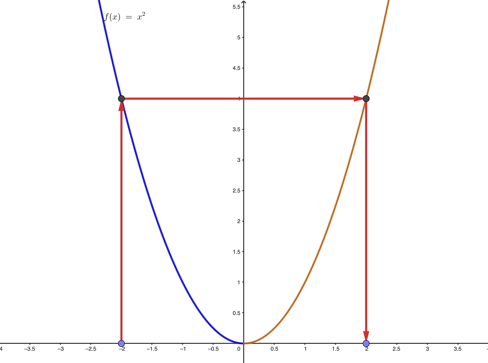

---

**Sesión 07. Regla de la cadena. Derivada de la función inversa y derivación logarítmica.**

{width="80%"}

Aguila Calzada, P.N. Doñana, Cádiz.

+ [Notebook de la sesión en Colab](https://colab.research.google.com/drive/1Bh7SBUUaxHCjsY34Di8n1tNZSXe0kZTD?usp=sharing)


---

```{=latex}
  
  \frametitle{Tabla de contenidos}
  \tableofcontents

```


# Introducción. 

En esta sesión continuamos ampliando el catálogo de reglas de derivación, empezando por la Regla de la Cadena. Este resultado nos permite derivar funciones compuestas. Para entender la composición de funciones puede resultar útil pensar en una calculadora que tiene teclas para funciones como el seno, el logaritmo, la raíz cuadrada, etc. Cuando introducimos un número $x$, si pulsamos dos teclas consecutivamente, por ejemplo el seno y después la raíz, estamos calculando el valor de la función compuesta $\sqrt{\sin{x}}$. Y puesto que sabemos derivar por separado el seno y la raíz, queremos aprovechar esos conocimientos para derivar esta composición, que es *"una función dentro de otra función"*.

Asumimos, como con el resto de reglas de derivación, que tienes ya alguna experiencia aplicando la Regla de la Cadena. El objetivo aquí es darte un margen para repasar su uso y alcanzar una comprensión conceptual  más profunda de sus implicaciones.

También nos asomaremos al tema de las funciones inversas. Haremos una versión simplificada, para entender los conceptos básicos, porque ese tema tiene bastante complejidad teórica y cubrirlo con rigor va más allá de los objetivos de este curso.

$\quad$


# Regla de la Cadena {.fragile}

::: {.callout-note  icon=false}

## Composición de funciones

La composición de las funciones $f(x)$ y $g(x)$ se define como la función 
$$(f\circ g)(x) = f(g(x))$$
Suponiendo que todos los valores involucrados están en los dominios de las funciones, sea $g(x_0) = y_0$ y sea $f(y_0) = z_0$. Usaremos a menudo diagramas como este para indicar la forma en la que los valores viajan a través de las funciones en la composición:
$$
\begin{tikzcd}
x_0 \arrow[r, "g"] & y_0 \arrow[r, "f"] & z_0
\end{tikzcd}
$$
:::

---

::: {.callout-note  icon=false}

## Regla de la Cadena

En las condiciones anteriores, si $g$ es derivable en $x_0$ y $f$ es derivable en $y_0 = g(x_0)$, entonces la composición $f \circ g$ es derivable en $x_0$ y se cumple: 
$$(f\circ g)' = f'(g(x_0)) \cdot g'(x_0)$$
:::

**Observaciones:** 

+ Es **esencial** que las derivadas de $f$ y $g$ se evalúen en los puntos correctos. Usa diagramas como el de la página anterior en caso de duda.
+ La Regla de la Cadena se puede aplicar a composiciones más profundas, con más de dos funciones.
+ La Regla de la Cadena se obtiene de forma natural aproximando cada función por su recta tangente. Entonces, para aproximar $f(g(x))$ ($g$ dentro de $f$) lo que hacemos es sustituir la recta tangente de $g$ dentro de la recta tangente de $f$, reorganizar para que sea la ecuación de una recta y mirar su pendiente.

::: {.callout-tip  appearance="minimal"}

\textbf{\textcolor{firebrick}{Ejercicio 07B01.}} Comprueba que así se obtiene la Regla de la Cadena. Indicación: es mejor que uses la notación $y = g(x)$, $z = f(y)$ para evitar confusiones. 

:::

---

::: {.callout-tip  appearance="minimal"}

\textbf{\textcolor{blue}{Ejercicio 07A01.}} Calcula las siguientes derivadas, identificando primero en cada caso las funciones $f$ y $g$ y los puntos donde se calculan las derivadas:

(a) $x \to \sin(3x^2 - 5x)$ en $x_0 = 0$.  

(b) $x \to \sqrt[3]{4 - x^2}$ en $x_0 = 2$.  

(c) $x \to  e^{\cos(2x)}$ en $x_0 = \pi/6$. ¡Repasa seno y coseno de ángulos notables!  

(d) $x \to \cos^3(x^2 + \pi/3)$ en $x_0 = \sqrt{\pi}$.  

(e) $x \to \sqrt{1 + \sin^2(3x)}$ en $x_0 = \pi/3$.  


$\quad$

\textbf{\textcolor{firebrick}{Ejercicios Hoja 2B GITI 25-26.}} 4 y 5 (salvo $a^{\sin x}$). 

$\quad$

\textbf{\textcolor{darkgreen}{Ejercicio 07C01.}} Usa el notebook de esta sesión para hacer los ejercicios previos. 

:::

---

\small

::: {.callout-note  icon=false}

## Derivación logarítmica

Recuerda que la derivada de la función logaritmo natural es
$(\log x)' = \frac{1}{x}$.
La Regla de la Cadena se puede usar junto con este resultado para derivar funciones de forma exponencial $f(x) = g(x)^{h(x)}$ (asumimos que $g(x) > 0$ para que el logaritmo esté definido y que $g$ y $h$ son derivables).

$(1)$ Primero tomamos el logaritmo y usamos sus propiedades:
$$\log f(x) = h(x) \log(g(x))$$
$(2)$ Puesto que ambos lados son iguales, sus derivadas también. Usando la derivada del producto, la del logaritmo y la Regla de la Cadena obtenemos:
$$\left(\log f(x)\right)' = \underbrace{\frac{f'(x)}{f(x)}}_{\text{deriv. izda.}} = 
\underbrace{h'(x) \log(g(x)) + h(x) \cdot \frac{g'(x)}{g(x)}}_{\text{deriv. dcha.}}$$

$(3)$ Despejando, y recordando la definición de $f(x)$,  eso conduce a esta fórmula para $f'(x)$:
$$f'(x) = f(x) \left(h'(x) \log(g(x)) + h(x) \cdot \frac{g'(x)}{g(x)}\right)$$
**Nota:** Es mucho mejor aplicar estos pasos cada vez que recordar esta fórmula.
:::
\normalsize


---

::: {.callout-tip  appearance="minimal"}

\textbf{\textcolor{blue}{Ejercicio 07A02.}} Calcula la derivada de $f(x) = x^x$

$\quad$

\textbf{\textcolor{firebrick}{Ejercicios Hoja 2B GITI 25-26.}} 5b y 7.  


:::

# Derivada de la función inversa {.fragile}


::: {.callout-note  icon=false}

## Función inversa

Sea $f(x)$ una función. A menudo conviene pensar en una función como una especie de máquina que convierte números en números. La notación $y = f(x)$ indica que un número $x$ entra en la función y un único número (esto es esencial) $y$  sale de la función. En un diagrama
$\begin{tikzcd}x \arrow[rr, "f"] & & y \end{tikzcd}$

Hablando informalmente, la inversa de $f(x)$ es una función $f^{-1}(y)$ que deshace lo que ha hecho $f(x)$ llevándonos de vuelta de la $y$ a la $x$. Un ejemplo típico es la función $y = x^3$ y su inversa $x = \sqrt[3]{y}$. 
\small
$$
\begin{tikzcd}
x \arrow[rr, bend left=30, "f"] & & y \arrow[ll, bend left=30, "f^{-1}"]
\end{tikzcd}
$$
\normalsize
**Cuidado, la notación es mala.** NO confundas la inversa $f^{-1}$ con la potencia negativa, que es  $\frac{1}{f(x)}$. Recuerda que $\sqrt[3]{y}$ NO es $1/y^3$.  
**No siempre existe la inversa** (ver *Observaciones* al final de la sesión).

:::

## {.fragile}


::: {.callout-note  icon=false}

## Derivada de la inversa

Vamos a ver cómo podemos relacionar la derivada de $f$ con la de su inversa. Supongamos por tanto que:

*  $f$ es derivable en $x_0$ 
* $y_0 = f(x_0)$ 
* existe la inversa $f^{-1}$ y es derivable en $y_0$. 

Empezamos observando que para todos los $x$ de un entorno de $x_0$ se debe cumplir
$$f^{-1}(f(x)) = x$$
Si los dos lados de esta ecuación son iguales, sus derivadas también lo serán, Así que, aplicando la Regla de la Cadena:
$$(f^{-1})'(f(x))\cdot f'(x) = 1$$
En particular, sustituyendo $x = x_0$ obtenemos
$$(f^{-1})'(y_0)\cdot f'(x_0) = 1,\quad\text{ es decir }\quad (f^{-1})'(y_0) = \frac{1}{f'(x_0)}$$
:::

---

::: {.callout-tip  appearance="minimal"}

\textbf{\textcolor{blue}{Ejercicio 07A03.}} Recuerda que $(\tan(x))' = 1 + \tan^2(x)$. Úsalo para hallar, mediante la fórmula para la derivada de la inversa, cuál es la derivada de la función arcotangente. *Sugerencia de notación:* empieza con $y = f(x) = \tan(x)$ y escribe $f^{-1}(y) = \arctan(y)$. 


$\quad$

\textbf{\textcolor{firebrick}{Ejercicios Hoja 2B GITI 25-26.}} 6, 8 y 9. 


:::

# Observaciones {.fragile}

::: {.callout-note  icon=false}

## No siempre existe una inversa sencilla (global)

Hemos dicho que el cubo y la raíz cúbica son un ejemplo típico de función y su inversa. Para esas funciones, si empiezas con un valor $x$ *cualquiera*, calculas $y = x^3$ para después calcular $\sqrt[3]{y}$, *siempre* volverás al mismo valor $x$ de partida.

\small
$$
\begin{tikzcd}
x \arrow[rr, bend left=30, "x^3"] & & y \arrow[ll, bend left=30, "y^{1/3}"]
\end{tikzcd}
$$
\normalsize
¿Por qué no hemos elegido el cuadrado y la raíz cuadrada? Ese caso no es tan sencillo. Por ejemplo, si empezamos en $x = -2$ terminaremos en $2$:  
$$
x = -2 \quad \Rightarrow \quad y = x^2 = 4 \quad \Rightarrow \sqrt{y} = 2
$$
*Recuerda* que $\sqrt{\phantom{2}}$ siempre se refiere a la raíz positiva (como la tecla de una calculadora) y que una función toma un valor a lo sumo. *No puedes* escribir $\pm\sqrt{\phantom{2}}$ y *elegir* el valor, porque $\pm\sqrt{\phantom{2}}$ no es una función.

:::

## {.fragile}

::: {.callout-note  icon=false}

## Inversas locales

\small

¿Qué hace diferentes estos dos ejemplos? La respuesta está en las gráficas de $x^2$ por un lado y de $x^3$ por otro. La función cubo es creciente, mientras que el cuadrado es decreciente en el semieje $x < 0$ y creciente en $x > 0$. Como ilustra la figura eso hace que, sea cual sea el $x$ de partida, existen dos puntos de la gráfica a altura $x^2$. La "inversa" $\sqrt{\phantom{2}}$ siempre baja al eje $X$ desde el punto de la derecha. Si empezaste con $x$ a la derecha, no hay problema. Pero si empezaste a la izquierda, no funciona. La función $\sqrt{\phantom{2}}$ es una **inversa local**, que sólo funciona a la derecha (para $x > 0$).

{height="3cm" fig-align="center"}
Hay otra inversa local definida mediante $-\sqrt{\phantom{2}}$ que funciona a la izquierda, para $x < 0$. Pero es importante entender que **no hay una inversa global que funcione para todos los valores de $x$**. Exploraremos esto con más detalle en el notebook de la sesión.

\normalsize
:::

