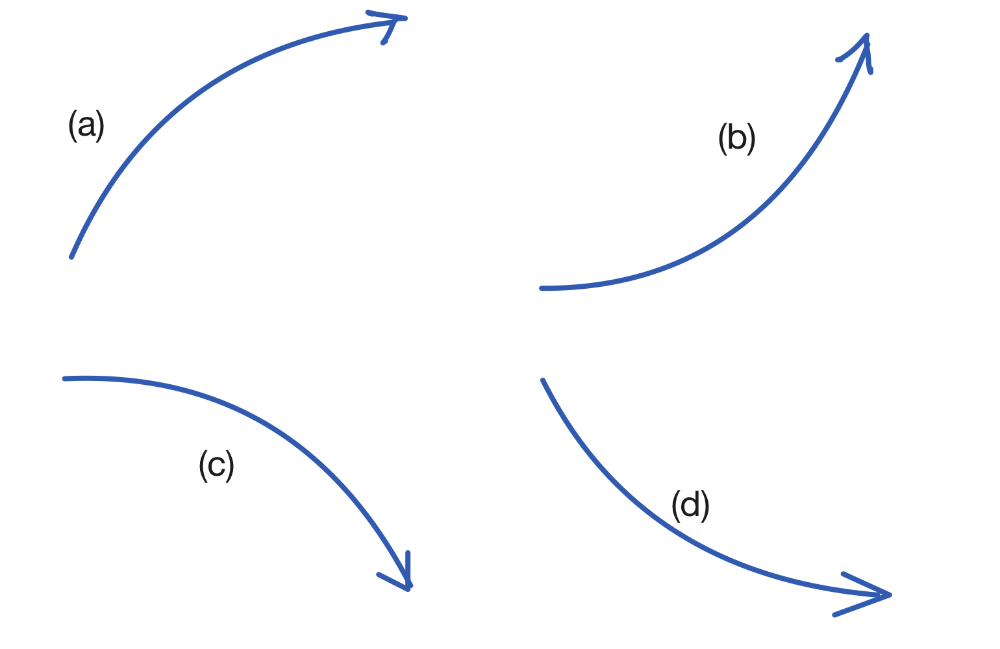
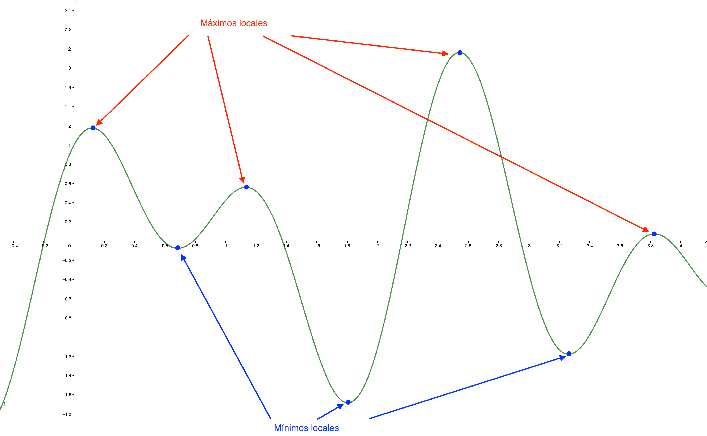
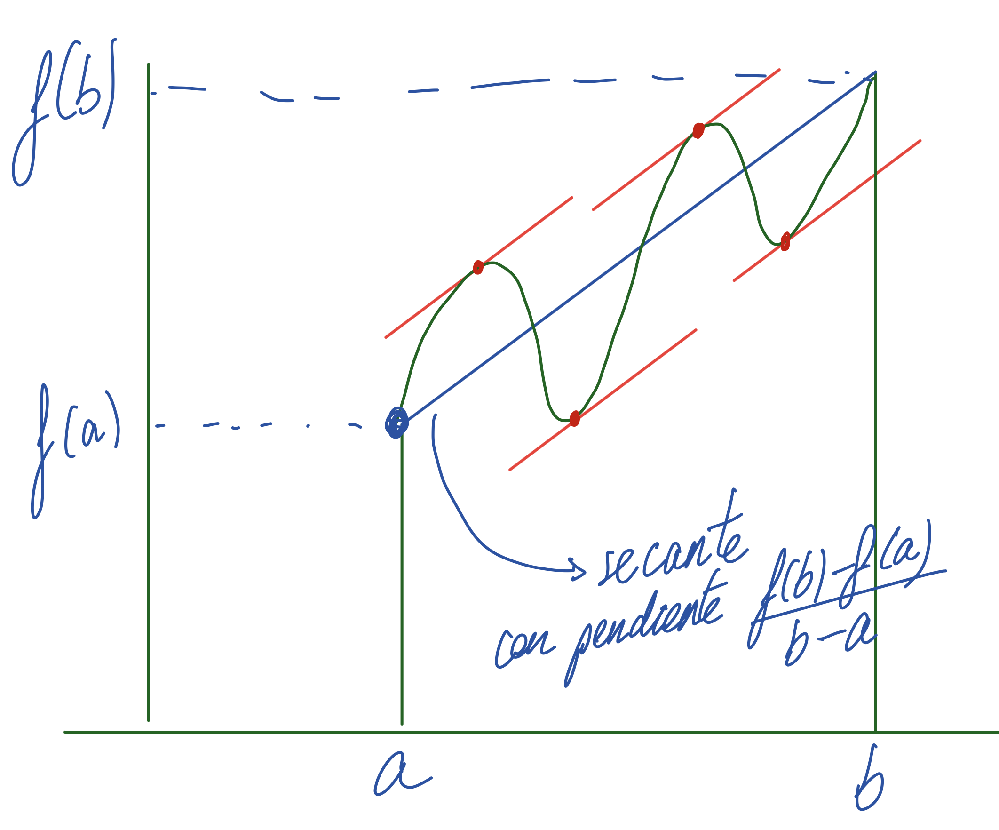

---

**Sesión 11. Optimización.**

{width="80%" fig-align="center"}

Curruca capirotada, Villaviciosa, Asturias.

+ [Notebook de la sesión en Colab](https://colab.research.google.com/drive/1PRPhNHIJUiIC7ZQEekBShl3-Os3MsQrz?usp=sharing)


---

```{=latex}
  
  \frametitle{Tabla de contenidos}
  \tableofcontents

```


# Introducción. 

\small

En esta sesión vamos a usar los resultados sobre valores extremos que hemos obtenido en la anterior sesión para encontrar las soluciones óptimas a varios problemas que sirven de ejemplo de las aplicaciones del Cálculo. La primera idea que debemos tener presente es que no todos los problemas de optimización tienen solución. Si buscamos el valor máximo de $1/x$ en el intervalo $(0, 1)$ no lo encontraremos porque la función toma en ese intervalo valores arbitrariamente grandes cuando $x\to 0$. Así que empezaremos por un resultado teórico que nos permite  

$\quad$


\normalsize

# Crecimiento y decrecimiento de una función. Extremos locales. {.fragile}

::: {.callout-note  icon=false}

## Vocabulario básico sobre crecimiento.

\small

Una función $f(x)$ es **creciente** en un intervalo $I$ si para cualesquiera dos puntos $a < b$ de $I$ se cumple $f(a)\leq f(b)$. La función es **estrictamente creciente** si siempre se cumple la desigualdad estricta $f(a) < f(b)$.

De modo análogo se define **decreciente** y **estrictamente decreciente**. 

Desde el principio queremos invitarte a pensar en que, incluso en el caso de funciones sencillas estrictamente crecientes o decrecientes, existen cuatro tipos básicos de comportamiento, de (a) a (d) en esta figura.

\qquad\qquad\qquad\qquad\qquad{width="35%"}

Las gráficas de muchas funciones sencillas se pueden ver como una concatenación de arcos de uno de estos tipos.

\normalsize

:::

---

::: {.callout-note  icon=false}

## Y vocabulario básico sobre extremos.

\small

La función $f(x)$ alcanza un **máximo local o relativo** en $x_0$ si existe un intervalo $I$ que contiene a $x_0$ tal que $f(x) \leq f(x_0)$ para todo $x$ de $I$ (y con $x$ en el dominio de $f$). De modo análogo se define un **mínimo local o relativo.** Los máximos y mínimos locales se denominan conjuntamente **extremos locales.** Busca en la siguiente figura arcos de los tipos (a) hasta (d).

\qquad\qquad\qquad{width="70%"}

Cuando $f(x)\geq f(x_0)$ para todos los $x$ del dominio de $f$ decimos que $f$ alcanza un **máximo absoluto** en $x_0$. 

\normalsize

:::

# Relación entre crecimiento y signo de la derivada. Puntos críticos.

::: {.callout-note  icon=false}

## Interpretación del signo de la derivada

\small

Aunque ya lo avanzamos al discutir el Teorema de Rolle, vamos a hacer un enunciado formal. Sea $f$ una función derivable en todos los puntos de un intervalo $I$ contenido en su dominio. Entonces:

$(1)$ $f$ es creciente en $I$ si y sólo si$f'(x)\geq 0$ para todo $x$ de $I$.  
$(2)$ $f$ es decreciente en $I$ si y sólo si $f'(x)\leq 0$ para todo $x$ de $I$.  
$(3)$ $f$ es *estrictamente* creciente en $I$ si y sólo si $f'(x)> 0$ para todo $x$ de $I$.  
$(4)$ $f$ es *estrictamente* decreciente en $I$ si y sólo si $f'(x)<0$ para todo $x$ de $I$.   

De esa manera, si sabemos analizar el signo de $f'(x)$, entenderemos el crecimiento y decrecimiento de $f(x)$. 

Con esta [construcción GeoGebra](https://www.geogebra.org/m/rx5HHTT8) puedes explorar estas ideas.

\normalsize

:::


::: {.callout-tip  appearance="minimal"}

\textbf{\textcolor{blue}{Ejercicio 10A01.}} Analizar el signo de la derivada e identificar intervalos de crecimiento y decrecimiento para la función:
$f(x) = (x^2 −3x + 1)e^x$
:::


# Relación entre extremos locales y signo de la derivada. 

::: {.callout-note  icon=false}

## Puntos críticos y extremos

\small

Identificar los intervalos en los que el signo de la derivada se mantiene constante conduce a localizar los **puntos críticos** de la función, que son de dos tipos:

+ puntos donde $f'(x) = 0$
+ puntos donde $f'$ no existe. **¡No olvides este tipo de puntos!**

::: {.block}


### Condición necesaria **pero no suficiente** de extremo 

\small

Todos los extremos locales de $f$ son puntos críticos de $f$. ¡No funciona al revés! 

\normalsize

:::

\normalsize

:::

::: {.callout-warning  icon=false appearance=minimal}

\small

**Ejemplos clave:** recuerda siempre estos ejemplos, en el origen:
$$
\underbrace{f(x) = x^2}_{f'=0,\text{ extremo}},\qquad 
\underbrace{f(x) = x^3}_{f'=0,\text{ no extremo}},\qquad 
\underbrace{f(x) = |x|}_{f' \text{ no existe, extremo}},\qquad 
\underbrace{f(x) = \frac{1}{x^2}}_{f' \text{ no existe, no extremo}}
$$

\normalsize

:::

---

::: {.callout-note  icon=false}

## Criterio de la derivada primera (cambios de signo de $f'$).

\small

Sea $x_0$ un punto crítico de $f$ y supongamos que **$f$ es continua en $x_0$**. 
+ Si existe un intervalo $(a, b)$ que contiene a $x_0$ tal que:   
$f' > 0$ en $(a, x_0)$ y $f' < 0$ en $(x_0, b)$.  
Entonces $f$ alcanza un **máximo local** en $x_0$.

+ Análogamente, si existe un intervalo $(a, b)$ que contiene a $x_0$ tal que:   
$f' < 0$ en $(a, x_0)$ y $f' > 0$ en $(x_0, b)$.  
Entonces $f$ alcanza un **mínimo local** en $x_0$.

+ Finalmente, si $f'$ no cambia de signo al pasar por $x_0$, entonces $f$ **no alcanza extremo local** en $x_0$.

\normalsize

:::

\small

**Observaciones:**

+ Una de las virtudes del criterio de la derivada primera es que se puede aplicar a puntos donde $f$ no es derivable.

+ **La continuidad sin embargo es esencial**. Recuerda $f(x) = \frac{1}{x^2}$.

+ Para aplicarlo eficazmente piensa siempre en **factorizar la derivada** y analizar el signo de cada factor; después combínalos.

\normalsize

---

::: {.callout-tip  appearance="minimal"}

\textbf{\textcolor{blue}{Ejercicio 10A02.}} Usa esto y los resultados de 10A01 para clasificar los extremos locales de $f(x) = (x^2 −3x + 1)e^x$.

$\quad$

\textbf{\textcolor{blue}{Ejercicio 10A02.}} Hallar los intervalos de crecimiento y los extremos relativos de la función:
$$
f(x) = \begin{cases}-x&\text{ si }x< 0\\x^2-2x&\text{ si }x\geq 0\end{cases}
$$

$\quad$

\textbf{\textcolor{firebrick}{Ejercicio 10B01.}} Analiza el crecimiento y los posibles extremos locales de $f(x) = x^5 - 15 x^3 + 1$.

$\quad$

\textbf{\textcolor{darkgreen}{Ejercicio 10C01.}} Usa el notebook de esta sesión para dibujar estas funciones y confirmar tus resultados.

$\quad$

\textbf{\textcolor{firebrick}{Ejercicios Hoja 2B GITI 25-26.}} 26, 27, 28.

:::


# Derivadas de orden superior y extremos locales.

::: {.callout-note  icon=false}

## Análisis de puntos críticos mediante el polinomio de Taylor

\small

Aunque el criterio de la derivada primera es muy útil, su uso depende de nuestra capacidad de analizar el signo de $f'$. Es necesario por tanto disponer de alternativas cuando eso resulta difícil. La idea clave es que el polinomio de Taylor describe la forma de la función cerca del punto crítico que estemos examinando. Vamos a usar el siguiente ejercicio para explorar esta idea.

\normalsize

:::

::: {.callout-tip  appearance="minimal"}

\small

\textbf{\textcolor{blue}{Ejercicio 10A03.}} 

$(1)$ Supongamos que sabes que $f(3) = 7$, $f'(3) = 0$, $f''(3) = -4$. ¿Cómo te imaginas la gráfica de $f$ cerca de $x_0 = 3$?

\quad

$(2)$  ¿Qué cambiaría si fuera $f''(3) = 8$, manteniendo los valores $f(3)$ y  $f'(3)$?

\quad

$(2)$  Ahora supongamos que 
$$
f(3) = 7,\quad f'(3) = 0,\quad f''(3) = 0,\quad\ldots\quad,\, f^{(7)}(3) = 0,\quad f^{(8)}(3) = -2.
$$
¿Cómo es la gráfica de $f$ cerca de $x_0 = 3$?

\normalsize

:::

---

::: {.callout-note  icon=false}

## Criterio de las derivadas de orden superior

\small

Sea $f(x)$ una función con $n$ derivadas continuas en un punto crítico $x_0$.
Supongamos que 
$$
f′(x_0) = f′′(x_0) = \cdots = f^{(n−1)}(x_0) = 0\text{ pero que } f^{(n)}(x_0)\neq= 0
$$ 
Es decir, $n$ corresponde a la **primera derivada no nula después de que la primera derivada sea nula.** Entonces:

+ Si $n$ es par y $f^{(n)}(x_0) < 0$, $f$ alcanza un **máximo** local  en $x_0$.
+ Si $n$ es par y $f^{(n)}(x_0) > 0$, $f$ alcanza un **mínimo** local  en $x_0$.
+ Si $n$ es impar, $f$ **no** alcanza un extremo local en $x_0$.

\normalsize
:::


::: {.callout-tip  appearance="minimal"}

\small

\textbf{\textcolor{blue}{Ejercicio 10A04.}} Estudia si la función 
$$f(x) =\dfrac{x^{6}}{2} - e^{x^{6}} + \sin(x^{6}) + \cos(x^{3})$$
tiene un extremo local en $x_0 = 0$ y en tal caso, identifica de qué tipo es.   
**Indicación:** Taylor. 

\textbf{\textcolor{darkgreen}{Ejercicio 10C02.}} Haz los cálculos del ejercicio 10A04 **primero a mano**  y luego usa el notebook de esta sesión para comprobarlos.  


:::

# Ampliación: Teorema del Valor Medio

\small

Aunque no vamos a usarlo directamente, este teorema está detrás de varios de los resultados que hemos visto en esta sesión. Y es uno de esos teoremas globales valiosísimos, porque nos permite pasar de la **escala local microscópica** de la derivada en un punto, a la *escala global macroscópica* de un intervalo cuyo tamaño puede ser muy grande

\normalsize

::: {.callout-note  icon=false}

## Teorema del Valor Medio

\small

Sea $f$ una función continua en $[a, b]$ y derivable en $(a, b)$. Entonces existe al menos un valor $c \in (a, b)$, en principio desconocido, tal que
$$f(b) - f(a) = f'(c)\cdot (b - a)$$

\normalsize

:::

**Observación:** para empezar a entender la utilidad del teorema, fíjate en que siempre se cumple $b - a > 0$. Así que el signo del *incremento global* de $f$ en $[a, b]$ coincide con el signo de $f'(c)$. Aunque no sepas el valor de $c$, si sabes que $f' > 0$ en el intervalo, entonces puedes decir que $f(a)$ es ...   
Como ves, este teorema traslada la información sobre $f'$ a estimaciones sobre incrementos de $f$.

---

::: {.callout-note  icon=false}

## Interpretación geométrica del Teorema del Valor Medio

\small

Cuando la igualdad del Teorema del Valor Medio se escribe en forma de cociente del incremento de $f(x)$ y el incremento de la variable $x$
$$\dfrac{f(b) - f(a)}{b - a} = f'(c)$$
se presta a una interpretación geométrica muy intuitiva. El cociente de la izquierda es la *pendiente de la recta secante* que une $(a, f(a)$ con $(b, f(b)$. Y entonces el teorema viene a decir que las derivadas (pendientes locales o instantáneas) no pueden ser ni todo el rato mayores ni todo el rato menores que esa *pendiente media*. En algún punto (o en varios) ambas cantidades deben coincidir, como ilustra la figura.

\qquad\qquad\qquad\qquad\qquad{width="35%"}

\normalsize


:::


