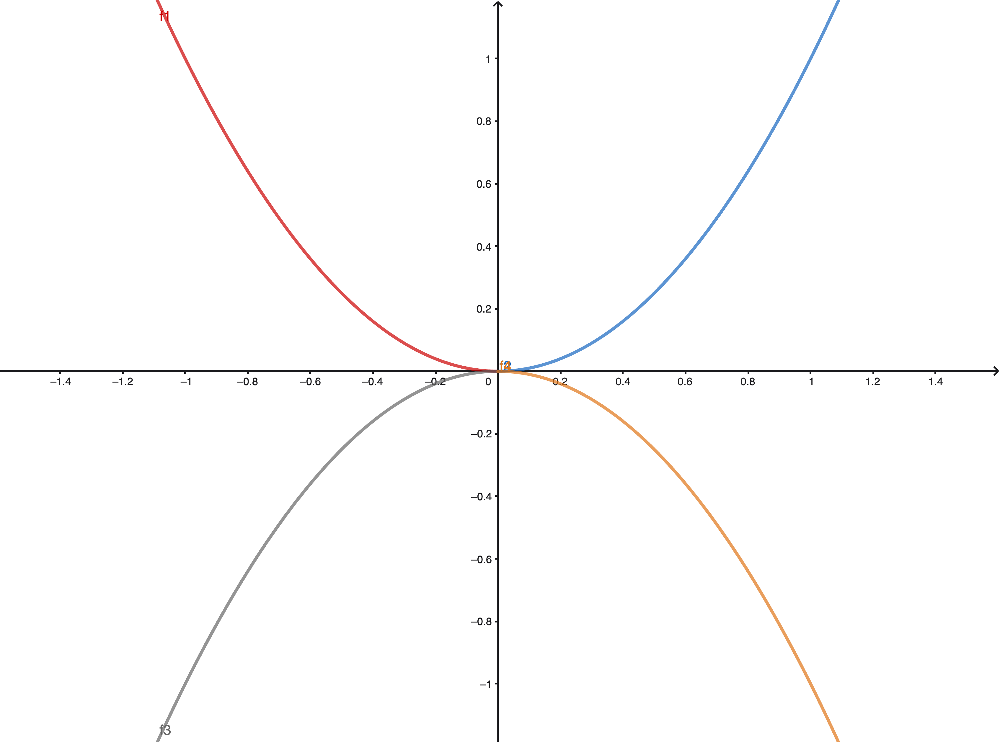

---

**Sesión 12. Curvatura.**

{width="80%" fig-align="center"}

+ [Notebook de la sesión en Colab](https://colab.research.google.com/drive/12s2l2WK2jA0iK_PTBW9QIvw6lhdiAHrW?usp=sharing)


---

```{=latex}
  
  \frametitle{Tabla de contenidos}
  \tableofcontents

```


# Introducción. 

\small

Esta sesión breve sirve para cerrar el capítulo del curso dedicado al Cálculo Diferencial en funciones de una variable y sus aplicaciones. El último tema que vamos a tratar es la noción de curvatura, estrechamente relacionada con el concepto de convexidad. Estas propiedades geométricas de las gráficas de las funciones son muy importantes cuando se estudian métodos más avanzados de optimización y, en general, al hacer un análisis más detallado de las propiedades de las funciones. Además, nos permiten entender que las derivadas de orden superior aportan información adicional sobre el comportamiento de la función.

$\quad$

\normalsize

# Convexidad {.fragile}

::: {.callout-note  icon=false}

## Relación entre la gráfica de una función y su recta tangente

\small

Para hablar de curvatura tenemos necesariamente que ir más allá de las rectas. Pero basta con pensar en las parábolas más sencillas de todas para encontrar *casi* todo lo que necesitamos. En la siguiente figura hemos incluido las dos parábolas $y = x^2$ e $y = -x^2$. Además hemos coloreado cuatro *ramas* en las gráficas. Fíjate en que la rama derecha (para $x>0$) de $y=x^2$ así como la rama izquierda de $y = -x^2$ son ambas crecientes. Pero crecen *de forma distinta*.

\normalsize

{width="40%" fig-align="center"}

De la misma forma, las dos ramas decrecientes (la izquierda en $y=x^2$ y la derecha en $y = -x^2$) también decrecen de distinta forma. 

:::

---

::: {.callout-note  icon=false}

## La relación con la recta tangente.

\small

Es importante entender que la derivada primera no puede ayudarnos a distinguir entre esas dos formas de crecer. Dos funciones crecientes pueden tener la misma recta tangente pero crecer de formas distintas.

\normalsize

:::

::: {.callout-tip  appearance="minimal"}
\small

\textbf{\textcolor{blue}{Ejercicio 12A01.}} Fíjate en las dos funciones $f(x) = e^x - 1$ y $g(x) = \log(1 + x)$. ¿Cuál es su recta tangente en $x_0 = 0$?

\textbf{\textcolor{darkgreen}{Ejercicio 12C01.}} Usa el notebook para visualizar estas funciones y su recta tangente. ¿Qué puedes decir sobre la *posición* de la recta tangente con respecto a las funciones?

:::

::: {.callout-note  icon=false}

## Convexidad en funciones derivables

\small

El ejercicio anterior sirve de base para entender esta terminología:

Sea $f(x)$ derivable en un entorno de $x_0$. Si la gráfica de $f(x)$ en ese entorno queda por encima de la recta tangente a $f$ en $x_0$ entonces decimos que $f$ es **convexa** en $x_0$. Si la gráfica queda por debajo de la recta tangente, entonces $f$ es **cóncava** en $x_0$.  
Y diremos que $f$ es convexa (o cóncava) en $(a, b)$ cuando lo sea en cada punto de ese intervalo.

\normalsize

:::

---

::: {.callout-note  icon=false}

## Puntos de inflexión

\small

Si $x_0$ es un punto del dominio de $f$ donde la función cambia de cóncava a convexa o viceversa, diremos que $x_0$ es un **punto de inflexión** de $f$.

\quad

El ejemplo más sencillo en el que puedes pensar es el punto $x_0 = 0$ en la gráfica de $f(x) = x^3$. 

\normalsize

:::

\quad


::: {.callout-tip  appearance="minimal"}
\small

\textbf{\textcolor{blue}{Ejercicio 12A02.}} ¿Cuáles son los puntos de inflexión de $f(x) = \sin(x)$? ¿Y cuáles son los de $g(x) = \sin(3 x + \pi/3)$?  

*Un poco más difícil, usa tu intuición geométrica:* ¿Dónde crees que están los puntos de inflexión de $h(x) = x + \sin(x)$?

\quad

\textbf{\textcolor{darkgreen}{Ejercicio 12C02.}} Usa el notebook para visualizar la gráfica de 
$$f(x) = -120 x^6 + 1466x^5 - 7105x^4 + 17454x^3 - 22952x^2 + 15352x - 4095$$
**Indicación:** Utiliza un intervalo vertical (`ylim`)  con $-200\leq y \leq 50$.  
¿Cuántos puntos de inflexión observas? Haz una estimación *a ojo* de dónde se encuentran.


:::


# Derivadas de orden superior  y convexidad

::: {.callout-note  icon=false}

## La "parábola tangente"

\small

Cuando una función tiene $f''(x_0)\neq 0$ sabemos que su desarrollo de Taylor de orden 2 en $x_0$ es:
$$f(x) = \underbrace{f(x_0) + f'(x_0) (x - x_0) + \dfrac{f''(x_0)}{2} (x - x_0)^2}_{\text{parábola tangente}} + E_2(x)$$
Como hemos indicado, el polinomio de orden dos define una parábola de ecuación $y = f(x_0) + f'(x_0) (x - x_0) + \dfrac{f''(x_0)}{2} (x - x_0)^2$ que es la *parábola tangente* a la gráfica de $f$.  La idea entonces es que si nuestra función se parece a la parábola cerca de $x_0$, su concavidad/convexidad coincidirá con la de esa parábola. 

\normalsize

:::


::: {.callout-tip  appearance="minimal"}

\small

\textbf{\textcolor{blue}{Ejercicio 12A03.}} Vuelve a examinar las parábolas $y= x^2$ e $y = -x^2$ e identifica qué ramas son cóncavas y cuáles son convexas. Piensa en las derivadas segundas de estas parábolas. Haz una tabla de doble entrada de signos de las derivadas primera y segunda y coloca cada rama en la celda correspondiente.

:::

---

Este último ejercicio prepara el terreno para el siguiente resultado:

::: {.callout-note  icon=false}

## La derivada segunda y la convexidad.

\small

Si $f$ es dos veces derivable en un intervalo $(a, b)$ y $f''(x) > 0$ para $x\in(a, b)$, entonces $f$ es convexa en $(a, b)$ (es como $x^2$). De manera análoga, si $f''(x) < 0$ en $(a, b)$, entonces $f$ es cóncava en $(a, b)$ (es como $-x^2$).

Si existe un punto $x_0$ de $(a, b)$ en el que $f''$ cambia de signo, entonces $x_0$ es un punto de inflexión de $f$.

\normalsize

:::

\small
**Observaciones:**.  
$(1)$ Recuerda que hemos asumido que $f''$ existe en todos los puntos de $(a, b)$.  
$(2)$ Es muy importante entender que **en un punto de inflexión la recta tangente no tiene por qué ser horizontal.** Lo que ocurre en esos puntos es que la gráfica *cruza al otro lado* de la recta tangente.

\normalsize


::: {.callout-tip  appearance="minimal"}

\small

\textbf{\textcolor{blue}{Ejercicio 12A04.}} Estudiar la concavidad y convexidad y hallar los puntos de inflexión de la función
$$f(x) = x^3 + 3 x^2 + x + 1$$
\textbf{\textcolor{blue}{Ejercicio 12A05.}} Estudia los puntos de inflexión de $f(x) = x + \sin(x)$ (ya vista en el Ejercicio 12A02.)

\normalsize

:::

---


::: {.callout-note  icon=false}

## Polinomio de Taylor y concavidad

\small

Los ceros de la derivada segunda (o los puntos donde no existe) son los candidatos evidentes a ser puntos de inflexión. Si podemos analizar el signo de la derivada segunda, las cosas son más fáciles. Pero en ocasiones esto no es fácil y es bueno disponer de otro criterio, basado en el polinomio de Taylor como el que vimos para extremos locales. 

En concreto: sea $f(x)$ una función suficientemente derivable en un entorno del punto $x_0$. Supongamos que $f′′(x_0) = 0$ y que la primera derivada no nula de $f(x)$ en $x_0$ **posterior a la segunda** es de orden impar. Entonces $f$ tiene un punto de inflexión en $x_0$.

\normalsize

:::


::: {.callout-tip  appearance="minimal"}

\small


\textbf{\textcolor{firebrick}{Ejercicios Hoja 2B GITI 25-26.}} 34b(b), 35 y 36.

:::
