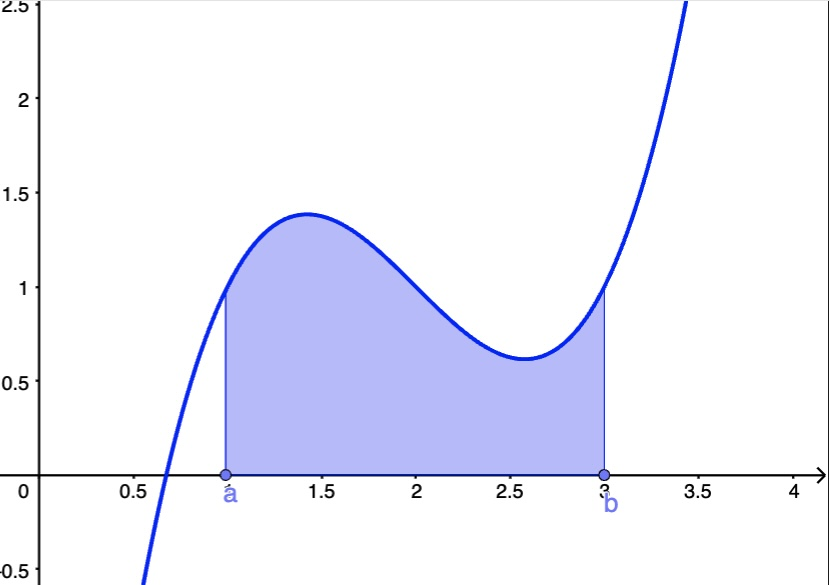
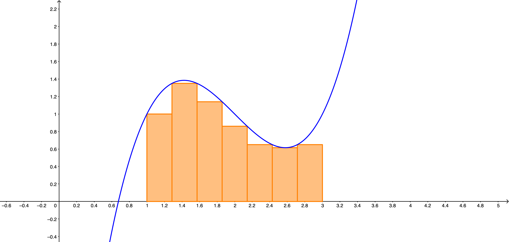

---

**Sesión 13. La integral.**

{width="80%" fig-align="center"}

+ [Notebook de la sesión en Colab](https://colab.research.google.com/drive/1srqdvKUUfwySsaMPpxx-TZBWa29YCh-X?usp=sharing)


---

```{=latex}
  
  \frametitle{Tabla de contenidos}
  \tableofcontents

```


# Introducción. 

\small

Con esta sesión comenzamos el estudio de la otra gran protagonista del Cálculo, la integral. Al igual que ocurre con la derivada, la motivación inicial que se utiliza habitualmente en los libros de texto puede resultar engañosa. Se dice a menudo que la motivación de la integral es el cálculo de áreas. Y es cierto que ese es el contexto donde las ideas resultan más intuitivas. Pero queremos enfatizar desde el principio que, si su única aplicación fuera el cálculo de áreas la integral sería una herramienta mucho menos importante y no ocuparía en el estudio del Cálculo el espacio que vamos a dedicarle. 


En las próximas sesiones veremos que la integral es una idea muy general que permite descomponer un problema como suma de las contribuciones de muchos (¡muchísimos!) elementos pequeños o sencillos en algún sentido, para obtener el resultado global combinado que producen. Por poner un ejemplo, en Física se aprende la Ley de la Gravedad que nos dice cómo es la fuerza de gravedad que ejerce una *párticula*. Pero cuando queremos aplicar esa ley para entender el efecto de la gravedad terrestre sobre el vuelo de un ave, no tiene sentido pensar en la Tierra como una partícula. Debemos ser capaces entonces de pasar de lo microscópico (partículas) a lo macroscópico (la Tierra). La integral es la operación matemática que nos permite ese cambio de perspectiva. Y no queremos dejar de mencionar que las aplicaciones de la integral en Probabilidad y Estadística son, por si mismas, suficientes para justificar el tiempo que vamos a dedicarle. 

\normalsize

# Problemas de área {.fragile}

::: {.callout-note  icon=false}

## Fórmulas clásicas de área

\small

Los primeros problemas de área que encontro la humanidad tienen que ver con figuras geométricas muy sencillas, como los rectángulos, triángulos y otras similares: trapecios, polígonos regulares, etc. Las fórmulas para el área de esas figuras y las propiedades básicas del área (como la aditividad) serían durante muchos siglos suficientes para las necesidades técnicas de la época. Con una excepción notable: el círculo es una figura muy sencilla de trazar (una estaca clavada en el suelo y una cuerda tensa bastan) y muy utilizada. Pero la fórmula del área del círculo no es evidente, como atestiguan los documentos más antiguos que tratan del tema y que usan expresiones erróneas del área. 

\quad

Podemos asociar la visión moderna con el nombre de Arquímedes, que en el 250 a.C. estableció $\pi r^2$ y dio un valor aproximado de $\pi\approx 31/7$ utilizando un método que ilustramos con la siguiente [construcción GeoGebra](https://www.geogebra.org/m/auz8umw8). En esa construcción verás que la idea de Arquímedes consiste en *atrapar* el área del círculo entre la de dos polígonos regulares, **uno por exceso y uno por defecto** y a continuación **reducir iterativamente el error** aumentando el número de lados.

Como veremos a continuación, el enfoque de Arquímedes es visionariamente moderno, adelántandose en más de mil años al desarrollo del Cálculo integral. 

\normalsize


:::

# Área bajo la gráfica de una función y sumas de Riemann

\small

En el siglo XVII  se planteó una reformulación del problema del área en el lenguaje de las funciones. El concepto no se estableció con rigor hasta el siglo XIX (con Riemann), pero las ideas básicas ya estaban presentes en tiempos de Newton y Leibniz. 

::: {.callout-note  icon=false}

## Área bajo la gráfica de una función

\small

Dada una función $f(x)$ y un intervalo $[a, b]$ (piensa por ejemplo en $f(x) = x^2$ y $[0, 1]$) queremos estudiar el área bajo la gráfica de $f(x)$ y sobre ese intervalo, como ilustra la figura.

{width="30%" fig-align="center"}

\normalsize

:::

::: {.callout-tip  appearance="minimal"}
\small

\textbf{\textcolor{blue}{Ejercicio 13A01.}} Este problema de área es más general de lo que parece. Dibuja el área bajo la gráfica de $f(x) = \sqrt{1 - x^2}$ en el intervalo $[-1, 1]$.

\normalsize

:::

---

::: {.callout-note  icon=false}

## Aproximaciones al área bajo la gráfica

\small

La forma en la que vamos a abordar este problema es típica del Cálculo. Sea $A$ el área bajo la gráfica de $f(x)$ y sobre el intervalo $[a, b]$. Definimos una aproximación:
$$A = \text{aproximación} + \text{error}$$
y construimos un procedimiento para hacer ese error tan pequeño como sea necesario. 

¿Cómo vamos a hacer esa aproximación? Mediante la suma de áreas muy sencillas: áreas de rectángulos. La siguiente figura ilustra esta idea.

{width="50%" fig-align="center"}

¿Cómo conseguimos que el error se haga pequeño? Aumentando el número de rectángulos. 

Para llevar adelante este plan necesitamos un poco de terminología.

\normalsize

:::


---

\small

En la figura de la página anterior hemos aproximado el área bajo $f$ y sobre el intervalo $[1, 3]$ usando siete rectángulos. Las bases de esos rectángulos (en el eje $X$) dividen el intervalo en siete subintervalos (no hace falta que sean del mismo tamaño). Esta subdivisión es lo que llamamos una partición. 

\normalsize

::: {.callout-note  icon=false}

## Particiones y sumas de Riemann

\small

Formalmente, una **partición** del intervalo $[a, b]$ es una colección de $n + 1$ puntos
$$x_0 = a < x_1 < x_2 < \cdots < x_n = b$$
Esos $n + 1$ puntos dividen $[a, b]$ en $n$ subintervalos  (las bases de los rectángulos):
$$I_0 = [x_0, x_1], \ldots, I_k = [x_{k - 1}, x_k],\ldots, I_n = [x_{n - 1}, x_n]$$
Para definir los rectángulos necesitamos además una altura (y queremos que tenga algo que ver con $f$). Para cada subintervalo $I_k = [x_{k - 1}, x_k]$ desde $k = 1$  hasta $k = n$, sea $x_k^*$ un punto de $I_k$. Entonces la **suma de Riemann** correspondiente es: 
$$S = \sum_{k = 1}^n f(x_k^*)(t_k - t_{k - 1}) = \sum_{k = 1}^n\text{(área del rectángulo k-ésimo)}$$
¿Cómo se eligen los valores de los $t_k$ y los $x_k^*$? Vamos a conectar esto con las ideas de Arquímedes.

\normalsize

:::

---


::: {.callout-note  icon=false}

## Sumas superiores e inferiores

\small

Recuerda que Arquímedes atrapaba el área del círculo entre el área de un polígono exterior, la *aproximación por exceso*, y uno interior, la *aproximación por defecto*. Vamos a hacer lo mismo en el caso de funciones:

Para no complicarnos, supongamos que $f$ es continua en $[a, b]$. Entonces dado cualquier subintervalo $I_k$ de una partición, el Teorema de Weierstrass garantiza que existen:
$$
\begin{cases}
m_k = \text{mínimo absoluto de } f \text{ en }I_K\\[3mm]
M_k = \text{máximo absoluto de } f \text{ en }I_K\\
\end{cases}
$$
Y podemos usarlos para definir unas sumas de Riemann especiales. La suma inferior (*lower*) y superior (*upper*) de la partición $P$ con subintervalos $I_k$ son:
$$L(f, P) = \sum_{k = 1}^n m_k (t_k - t_{k - 1}), \qquad 
U(f, P) = \sum_{k = 1}^n m_k (t_k - t_{k - 1}) $$

Usa esta [construcción GeoGebra](https://www.geogebra.org/m/swvce9wb) o el notebook de la sesión para entender como se comportan las sumas superior e inferior al considerar particiones con muchos rectángulos.  

\normalsize

:::

---


::: {.callout-note  icon=false}

## La integral (caso de una función continua)

\small

Esos experimentos han debido convencerte de que, al menos en casos sencillos, (1) la suma inferior es una aproximación por defecto al área, (2) la suma superior es una aproximación por exceso y (3) que, al aumentar el número de rectángulos, las dos sumas inferior y superior se parecen cada vez más. 

Concretemos: sea $f$ continua en $[a, b]$. Dada una partición $P$ con subintervalos $I_k$, el **diámetro** de la partición es la longitud del mayor de esos subintervalos. Entonces, si consideramos **particiones con un diámetro suficientemente pequeño** (¡por tanto con muchos subintervalos!) la diferencia 
$$U(f, P) - L(f, P)$$
puede hacerse tan pequeña como se quiera y existe un único número, la **integral** de $f$ en $[a, b]$ que denotamos con 
$$\int_a^b f(x) dx$$
tal que, sea cual sea la partición $P$, se cumple:
$$L(f, P)\leq \int_a^b f(x) dx \leq U(f, P)$$


\normalsize

:::

---


::: {.callout-note  icon=false}

## ¿Y qué pasa con las sumas de Riemann?

\small

Para una partición $P$ cualquiera, independientemente de como se elijan los valores $x_k^*$ para formar la suma de Riemann, siempre se cumple esta desigualdad. 
$$L(f, P) \,\leq\,  \sum_{k = 1}^n f(x_k^*)(t_k - t_{k - 1})  \,\leq\, U(f, P)$$
Por lo tanto *para particiones con un diámetro suficientemente pequeño* se tiene
$$\int_a^b f(x)dx \approx \sum_{k = 1}^n f(x_k^*)(t_k - t_{k - 1})$$
insistimos, independientemente de como se elijan los $x_k^*$. 

\normalsize

:::


---


---


---

::: {.callout-tip  appearance="minimal"}
\small

\textbf{\textcolor{blue}{Ejercicio 12A01.}} Fíjate en las dos funciones $f(x) = e^x - 1$ y $g(x) = \log(1 + x)$. ¿Cuál es su recta tangente en $x_0 = 0$?

\textbf{\textcolor{darkgreen}{Ejercicio 12C01.}} Usa el notebook para visualizar estas funciones y su recta tangente. ¿Qué puedes decir sobre la *posición* de la recta tangente con respecto a las funciones?

:::


::: {.callout-tip  appearance="minimal"}

\small


\textbf{\textcolor{firebrick}{Ejercicios Hoja 2B GITI 25-26.}} 34b(b), 35 y 36.

:::

