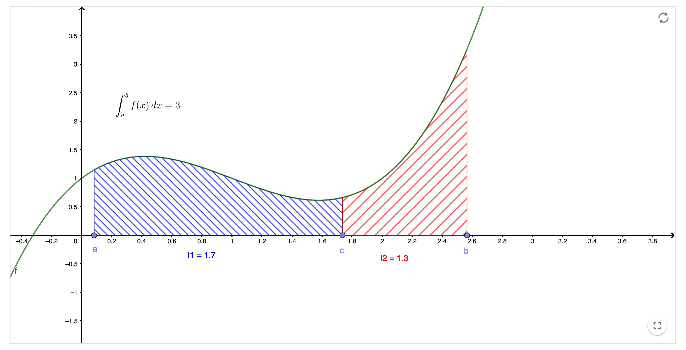

---

**Sesión 14. Propiedades de la integral. Funciones definidas por integrales.**

{width="80%" fig-align="center"}


+ [Notebook de la sesión en Colab](https://colab.research.google.com/drive/1srqdvKUUfwySsaMPpxx-TZBWa29YCh-X?usp=sharing)


---

```{=latex}
  
  \frametitle{Tabla de contenidos}
  \tableofcontents

```


# Introducción. 

\small

La primera parte de esta sesión continúa el trabajo de la anterior, analizando las propiedades básicas de la integral. En esa primera parte no hay nada demasiado sorprendente, porque todas las propiedades resultan intuitivas al apoyarse en la noción de área o al tener en cuenta que la integral es, en esencia, una suma. 

La segunda parte, casi al final, introduce la idea de funciones definidas mediante integrales. Como veremos, este es el paso clave para preparar el terreno para el Teorema Fundamental del Cálculo y la Regla de Barrow que veremos en la próxima sesión. 

\normalsize

# Propiedades de la integral {.fragile}

::: {.callout-note  icon=false}

## Linealidad

\small
Las combinaciones lineales de funciones integrables son integrables y se tiene:
$$
\int_a^b (c_1 f + c_2 g)(x)\,dx = c_1 \int_a^b  f(x)\,dx + c_2 \int_a^b g(x)\,dx
$$
para $f$ y $g$ integrables en $[a, b]$, $c_1, c_2$ números reales cualesquiera.  
*La integral de la suma es la suma de integrales, las constantes "salen fuera".*

\normalsize

:::

::: {.callout-note  icon=false}

## Propiedades de monotonía

\small
Sean $f$ y $g$ integrables en $[a,b]$: 

+ Si $f(x) \leq g(x)$ en $[a,b]$, entonces $\int_a^b f(x)\,dx \le \int_a^b g(x)\,dx$. 
+  $|f|$ también es integrable, con $\left| \int_a^b f(x)\,dx \right| \le \int_a^b |f(x)|\,dx$
+ Si $f(x) \geq 0]$ en $[a,b]$, entonces $\int_a^b f(x)\,dx \geq 0$


\normalsize

:::


---

::: {.callout-note  icon=false}

## Propiedades de aditividad del intervalo de integración

\small
Sea $f$ integrable en $[a,b]$. **Definimos:**

- $\int_a^a f(x)\,dx = 0$
- $\int_b^a f(x)\,dx = - \int_a^b f(x)\,dx = 0$

Con estas definiciones, sea $f$ integrable en el intervalo más grande que contiene a los tres números $a, b, c$. Entonces, sea cual sea el orden de $a, b, c$:
$$\int_a^b f(x)\,dx = \int_a^c f(x)\,dx\, + \int_c^b f(x)\,dx$$
La siguiente figura ilustra este resultado para un caso con $a < b < c$. Puedes explorar esta idea en esta [construcción GeoGebra](https://www.geogebra.org/m/p8rffjbh)

{align="center" width="50%"}


\normalsize

:::

---

::: {.callout-note  icon=false}

## Propiedades de simetría

\small
Sea $f$ integrable en un **intervalo simétrico** $[-a, a]$. Entonces

- Si $f$ es **impar**, con $f(-x) = -f(x)$, entonces $\displaystyle\int_{-a}^a f(x)\,dx = 0$
- Si $f$ es **par**, con $f(-x) = f(x)$, entonces 
$\displaystyle\int_{-a}^a f(x)\,dx = 2 \int_0^a f(x)\,dx = 0$

**Nota:** Para aplicar bien estas propiedades es esencial tener en cuenta el intervalo y la función.

\normalsize

:::

::: {.callout-note  icon=false}

## Invariancia por traslación

\small
Si $f$ integrable en $[a, b]$, entonces la **función trasladada** $f(x - K)$
es integrable en $[a + K, b + K]$ para cualquier *desplazamiento horizontal* $K$. Además
$$\int_a^b f(x)\,dx = \int_{a + K}^{b + K} f(x - K)\,dx$$
\normalsize

:::

**Nota:** Estas propiedad se puede combinar a menudo con la simetría, si se cumple por ejemplo $f(x - x_0) = -f(x_0 - x)$ ($f$ es impar respecto a $x_0$)

# Funciones definidas mediante integrales

::: {.callout-note  icon=false}

## Integral con intervalo variable

\small

Al discutir la aditividad de los intervalos $\int_a^b f(x)\,dx = \int_a^c f(x)\,dx\, + \int_c^b f(x)\,dx$
hemos usado esta [construcción GeoGebra](https://www.geogebra.org/m/p8rffjbh) para *mover el valor del límite de integración* $c$. Al hacer eso hemos deslizado la idea de que el valor de la integral puede considerarse como una función de $c$:
$$\text{valor de }c\longrightarrow\int_a^c f(x)\,dx$$
Esta forma de definir una función a partir de una integral con límite variable va a ser una de las ideas fundamentales del Cálculo y vamos a analizarla con detalle. Pero para hacerlo necesitamos una notación algo más cómoda. En primer lugar, nos gusta llamar $x$ a la variable en las funciones. Así que escribiremos
$$F(x) = \int_a^x f(t)\,dt$$
Fíjate en que cambiamos también el nombre de la variable de integración de $x$ a $t$ para no confundirlas. 

\normalsize

:::

--- 

::: {.callout-tip  appearance="minimal"}

\small

\textbf{\textcolor{blue}{Ejercicio 14A01.}} Sea 
$$
f(x) = \begin{cases}x & \text{ si }0 \leq x \leq 1\\0 & \text{en otro caso}\end{cases}
$$  
Usando fórmulas de área sencillas escribe una fórmula sin integrales para 

$F(x)= \displaystyle\int_0^x f(t)\, dt$

\textbf{\textcolor{blue}{Ejercicio 14A02.}} Un poco más complicado. Sea 
$$
g(x) = \begin{cases}
    0   & \text{ si }x < 0\\ 
2 - 2 x &\text{ si }0 \leq x \leq 2\\
2 x - 6 &\text{ si }0 \leq x \leq 2\\
    0   &\text{ si }x > 3\end{cases}
$$  
Escribe una fórmula sin integrales para 
$$G(x) = \int_0^x g(t)\, dt$$

\textbf{\textcolor{darkgreen}{Ejercicio 14C01.}} Usa el notebook para visualizar las funciones $f(x)$ y $F(x)$, en gráficos adyacentes. Luego haz lo mismo con $g(x)$ y $G(x)$.

\normalsize

:::


<!-- ::: {.callout-tip  appearance="minimal"} -->

<!-- \small -->


<!-- \textbf{\textcolor{firebrick}{Ejercicios Hoja 2B GITI 25-26.}} 34b(b), 35 y 36. -->

<!-- ::: -->

